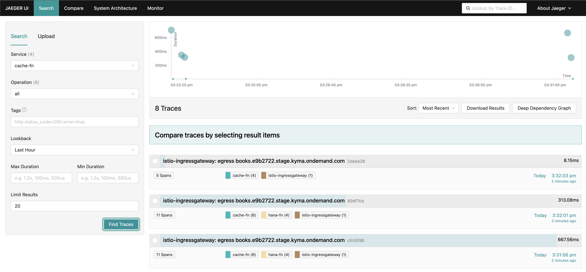

## Prerequisites


<!-- [Create hana instance](https://help.sap.com/docs/hana-cloud/sap-hana-cloud-administration-guide/create-sap-hana-database-instance-in-kyma-environment?locale=en-US) -->

<!-- https://community.sap.com/t5/technology-blogs-by-sap/provisioning-sap-hana-cloud-databases-from-kyma-and-kubernetes-2-kyma/ba-p/13577215 -->

<!-- TODO: initialize using hana design time stuff -->
Initialize DB manually
```sql

CREATE SCHEMA DKOM OWNED BY DBADMIN;

CREATE TABLE DKOM.BOOKS (
     id                 VARCHAR(64)     not null,
     title              VARCHAR(64)    null,
     author             VARCHAR(64)      null,
     primary key(id)
);
```

## How it works


## Verify

Read books  

`GET https://books.e9b2722.stage.kyma.ondemand.com`

Add book

`Post https://books.e9b2722.stage.kyma.ondemand.com` 
```json
{
     "author":"Astrid Lindgren",
     "title":"Pippi Goes On Board",
}
```

Inspect traces in browser https://jaeger.e9b2722.stage.kyma.ondemand.com/search

